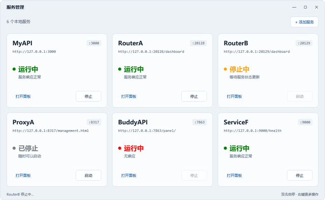
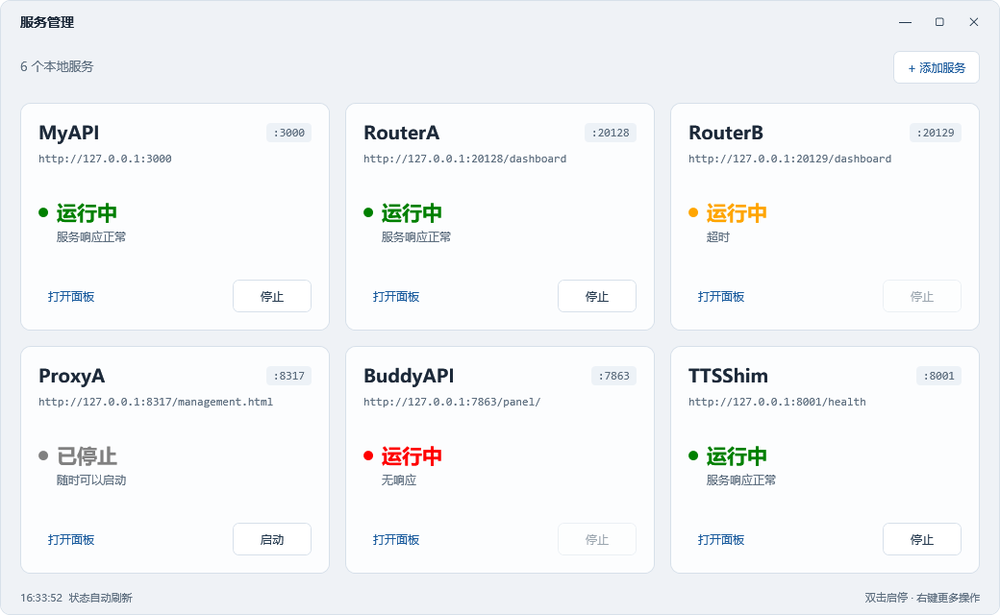

# nssm-service-manager

[](https://github.com/xvyimu/nssm-service-manager/actions/workflows/test.yml)

本地 NSSM Windows 服务的统一管理 GUI——PowerShell 7 + WPF，卡片式启停/健康探测/日志查看，零外部 npm 依赖。




## 为什么用它

NSSM 本身是命令行工具。服务一多，日常启停、查状态、看日志全靠背命令——这个工具把你的 NSSM 服务收敛成一个窗口：

- **一眼看全**——每张卡显示服务名、端口、健康圆点（绿=正常 / 橙=响应慢 / 红=无响应），六个服务一屏扫完，不用逐个 `sc query` 或开任务管理器
- **点两下启停**——双击卡片切换启停，右键管重启/日志/删除；8 秒冷却 + 健康门闩挡住「刚停下来又点启动」这类误操作
- **配置是清单不是代码**——`services.json` 一份 JSON 列出所有服务，换机器复制即用；CLI 也有增删入口（`-Add`），脚本和 agent 可以直接调用
- **健康探测不靠猜**——端口 TCP + HTTP 两档并行探测：服务在但响应慢标「超时」，端口没监听标「无响应」
- **安全默认**——删除服务要输入完整名称确认；密钥走 `TTS_API_KEY_FILE` 不落注册表（见「安全提示」）

如果你的机器上跑着三五个 NSSM 服务，它值得替代「任务管理器 + 手敲命令」的组合。

## 快速开始

```powershell
# 1. 装依赖（NSSM 用 scoop，或自行放置后设 NSSM_PATH）
scoop install nssm

# 2. 复制示例配置（config.json 可选，不复制就用内嵌默认值）
Copy-Item services.example.json services.json
Copy-Item config.example.json config.json

# 3. 跑回归测试（不需要管理员）
pwsh -NoProfile -File tests/run-all.ps1

# 4. 启动 GUI（会弹 UAC，NSSM/sc.exe 需要管理员）
pwsh -NoProfile -File service-manager-gui.ps1
```

双击入口是 `launch.vbs`（wscript 无控制台，不闪黑窗）。

## 文件

| 文件 | 作用 |
|------|------|
| `launch.vbs` | 启动器（双击入口）：wscript 无控制台 → ShellExecute runas pwsh → 管理员 GUI，零黑窗 |
| `service-manager-gui.ps1` | 主入口：CLI 分支 + 提权 + 模块加载 + 窗口启动 |
| `lib/theme.ps1` | 系统字体、主题色、按钮样式、Mica P/Invoke |
| `lib/util.ps1` | 配置持久化、NSSM 操作、安全检查、日志查看器 |
| `lib/poll.ps1` | 后台 runspace 探测脚本块（Get-Service 批量 + TcpClient + HttpClient 三档健康，sc.exe 退出码映射） |
| `lib/add-svc.ps1` | 添加服务（GUI 简化 + CLI agent 友好）+ 删除服务（输入全名确认）+ `Remove-NssmService` |
| `lib/svc-common.ps1` | UI 线程与后台 runspace 共用的服务操作原语（`Wait-Stopped` 只此一份，poll.ps1 构造 runspace 时前置其文本） |
| `lib/config.ps1` | 可调常量集中收口（每页卡片数 / 探测超时 / 日志轮转 / 双击冷却 / 托盘开关），默认值内嵌，`config.json` 覆盖 |
| `lib/tray.ps1` | 可选托盘图标（`TrayEnabled` 打开才加载 WinForms）+ 关闭/最小化策略纯函数 |
| `lib/card.ps1` | 卡片构建 + 双击防抖（8s 冷却 + 健康门闩）+ 过渡态保护 + 右键菜单 |
| `lib/xaml.ps1` | 主窗口外壳（自定义标题栏 + 最大化/双击标题栏 + 工具栏 + 分页 + 状态栏） |
| `assets/icon.ico` | 自绘齿轮图标（窗口 + 任务栏） |
| `services.example.json` | 服务清单示例（复制为 `services.json` 使用；后者已 git 忽略） |
| `config.example.json` | 可调常量示例（复制为 `config.json` 使用；后者已 git 忽略） |
| `st-tts-shim/server.mjs` | TTSShim 服务本体：StepFun TTS → OpenAI 兼容 `/v1/audio/speech` 薄适配层 |
| `st-tts-shim/test-speech.ps1` | TTSShim 打穿测试脚本 |
| `tests/run-all.ps1` | 统一执行 PowerShell 语法检查和全部回归测试 |
| `tests/make-screenshot.ps1` | 离屏渲染主窗口导出 `assets/screenshot.png` |
| `logs/` | NSSM 服务运行日志（`.out.log` / `.err.log`，git 忽略） |

## 启动

双击 `launch.vbs`（wscript 无控制台，不闪黑窗）→ UAC → 管理员 GUI。也可以直接 `pwsh -NoProfile -File service-manager-gui.ps1`（非管理员时脚本会用同一个 `launch.vbs` 提权）。

NSSM 路径按三档探测：`$env:NSSM_PATH` → `Get-Command nssm.exe` → scoop 安装路径（`~/scoop/apps/nssm/current/nssm.exe`）。都找不到时弹窗提示安装。进程声明 DPI Aware，高缩放屏下卡片不模糊。

## 配置层（防漂移）

- **`services.json` 是 SSOT**——GUI 运行时增删服务会原子写回它（`$PID.$guid.tmp` → `Replace`）。
- `lib/util.ps1` 的 `Load-Svc` 有回落链：`services.json` → `services.example.json` → 空清单。前者缺失或 JSON 解析失败时读示例清单（并在状态栏提示），首次运行不会是一片空白。**新增服务请走 GUI「添加」或 CLI `-Add`**——NSSM 注册必须由脚本完成（stdout/stderr/stop 超时/启动类型/日志轮转一并设置）。

## 功能

- 六张服务卡片以 3 列 × 2 行填满主区域，窗口缩放时同步伸展；单页隐藏分页按钮
- Microsoft YaHei UI + Consolas 系统字体，无需安装字体或启动时枚举
- 浅色高对比卡片，原生非 layered 窗口支持系统 Mica 背景；主题色统一收口到 `lib/theme.ps1` 的 `$script:T`，改色只动一份
- 每张卡：服务名、端口、URL、状态圆点、健康说明、打开面板、启停按钮
- 标题栏：最小化 / 最大化（按钮 + 双击标题栏切换）/ 关闭
- 健康三档：`正常`（绿）/ `超时`（橙，服务在但响应慢）/ `无响应`（红，端口未监听或连接被拒）；HTTP 超时 3 秒
- 双击卡片 = 启停切换，8 秒冷却 + 健康门闩（只有运行中+健康=正常才允许双击关闭）
- 过渡态保护：卡片处于启动中/停止中时，在途的旧探测结果不覆盖用户刚触发的过渡态，直到同方向的终态探测到达才收尾
- 右键卡片 = 启动/停止/重启/面板/日志/安全检查/删除（删除需输入完整服务名确认，红字标注；删除走后台命令队列，UI 不冻结）
- 单实例互斥：重复双击启动器只保留第一个窗口，第二个静默退出（Mutex 进程级，崩溃后自动释放）
- 重启走 stop→轮询 Stopped（最多 6s）→start，避免端口未释放导致 bind 失败
- 工具栏：添加服务 / 上一页 / 下一页
- 后台 runspace 探测（`Get-Service` 批量查询 + TcpClient + HttpClient 并行探测，UI 线程只取结果、刷新卡片）
- GUI 命令统一入队并唤醒后台；每次服务探测之间优先处理命令，避免等待整轮探测和固定空闲间隔
- `sc.exe` 失败时状态栏显示映射后的中文原因（1056 已在运行 / 1060 服务未安装 等），而非裸数字
- 日志查看器支持轮转历史下拉（NSSM `AppRotateFiles` 产生的 `*.out-*.log` / `*.err-*.log`），切换并刷新
- 删除服务后卡片缓存清零，同名重建显示新端口/URL；配置变更后翻页命中缓存也刷新
- 默认关闭即退出、最小化到任务栏；需要常驻可开托盘（见「可调常量」的 `TrayEnabled` / `MinimizeToTray` / `CloseToTray`）

## 托管的 6 个服务

`services.json` 是每台机器自己的配置（已 git 忽略，不上传）。克隆后复制 `services.example.json` 为 `services.json` 并按需改：

```
Copy-Item services.example.json services.json
```

示例清单（服务名/端口/面板/本体可全改）：

| 服务 | 端口 | 面板 | 本体 |
|------|------|------|------|
| MyAPI | 3000 | http://127.0.0.1:3000 | 独立部署 |
| RouterA | 20128 | http://127.0.0.1:20128/dashboard | 独立部署 |
| RouterB | 20129 | http://127.0.0.1:20129/dashboard | 独立部署 |
| ProxyA | 8317 | http://127.0.0.1:8317/management.html | 独立部署 |
| BuddyAPI | 7863 | http://127.0.0.1:7863/panel/ | 独立部署 |
| TTSShim | 8001 | http://127.0.0.1:8001/health | 本仓 `st-tts-shim/server.mjs`（NSSM `AppDirectory` 指向本目录，`AppEnvironmentExtra` 注入 `TTS_API_KEY`，`AppExit Default=Ignore` 不自动重启） |

> **安全提示（TTS_API_KEY 暴露面）：** NSSM 把 `TTS_API_KEY` 明文写入注册表 `HKLM\SYSTEM\CurrentControlSet\Services\TTSShim\Parameters\AppEnvironmentExtra`，该键 ACL 默认允许 `BUILTIN\Users` 读取——本机任意标准用户无需提权即可读出 65 字符明文密钥。**推荐用 `TTS_API_KEY_FILE`** 指向一个仅 Administrators+SYSTEM 可读的密钥文件（路径不进注册表，文件权限收口）；`server.mjs` 一旦检测到该变量设置，只从文件读密钥，文件读不出或为空则**拒绝启动，不回落 `TTS_API_KEY`**——防止配了文件却因回落重新把密钥留在注册表。彻底收紧注册表键 ACL 用 `scripts/set-service-params-acl.ps1`（见下）。

### 收紧 Parameters 注册表键 ACL（可选，深度防御）

即便改用 `TTS_API_KEY_FILE`，`Parameters` 键下可能仍有历史 `AppEnvironmentExtra` 残留。本脚本把该键 ACL 从默认的「Users 可读」收紧到 `Administrators + SYSTEM`：

```powershell
# 管理员 PowerShell
pwsh -NoProfile -File scripts/set-service-params-acl.ps1 -ServiceName TTSShim
```

脚本流程：禁用继承（保留本键显式 ACE、丢掉继承自 `Services` 的 Users 读权限）→ 移除 `BUILTIN\Users` 与 `Everyone` 的所有 Allow ACE → 确保 `Administrators` 与 `SYSTEM` 完全控制 → 读回校验无 Users/Everyone 残留。失败时不自动回退（回退会把权限重新放宽，更危险），提示人工处理。

## 可调常量（config.json）

每页卡片数、探测超时、日志轮转阈值、双击冷却等都收口在 `lib/config.ps1`，默认值内嵌、开箱即用。需要调时复制示例：

```
Copy-Item config.example.json config.json
```

`config.json` 已 git 忽略（与 `services.json` 同构：示例进仓，实配每台机器自定）。未知键忽略，类型强转；解析失败不阻断启动，回落默认值并在状态栏提示。可用键：

| 键 | 默认 | 作用 |
|------|------|------|
| `PerPage` | 6 | 卡片每页数量（`xaml.ps1` UniformGrid 列数按 `ceil(sqrt(PerPage))` 自适应） |
| `TcpTimeoutMs` | 200 | 端口探测超时（`poll.ps1` TcpClient BeginConnect） |
| `HttpTimeoutMs` | 3000 | HTTP 探测超时（`poll.ps1` 共享 HttpClient.Timeout） |
| `CrashLogMaxBytes` | 524288 | `gui-crash.log` 轮转阈值（512 KiB，超则挪成 `.1`） |
| `ToggleCooldownMs` | 8000 | 双击启停冷却（`card.ps1` Invoke-CardToggle） |
| `WaitStoppedTimeoutMs` | 6000 | 重启/删除前轮询 Stopped 的上限（`lib/svc-common.ps1` 的 `Wait-Stopped`，UI 线程与 runspace 共用一份） |
| `TrayEnabled` | false | 托盘总开关；关时下面两项无效，也不加载 WinForms |
| `MinimizeToTray` | false | 点最小化收进托盘（需 `TrayEnabled`） |
| `CloseToTray` | false | 关闭窗口收进托盘而非退出（需 `TrayEnabled`） |

托盘默认全关，行为与历史一致：最小化进任务栏、关闭即退出。三项都要开托盘才生效——只开 `CloseToTray`/`MinimizeToTray` 而总开关关，按默认处理（没有托盘可收）。托盘菜单有「显示主窗口」和「退出」，双击托盘图标也显示主窗口；「退出」是唯一能真正退出的入口（`CloseToTray` 下点 ✕ 只隐藏）。

## 依赖

- PowerShell 7（`pwsh`）
- NSSM 2.24（scoop 安装，或自备后设 `NSSM_PATH`）
- Node.js 18+（仅 TTSShim 需要，内置 `http` + 全局 `fetch`，无 npm 依赖）

## 添加新服务

**GUI**：工具栏「添加服务」→ 3 必填（服务名/端口/可执行文件）+ 高级折叠（URL/工作目录/启动参数/环境变量）。

**CLI（agent 友好）**：
```
pwsh -NoProfile -ExecutionPolicy Bypass -File service-manager-gui.ps1 -Add Name,Port,Exe[,Url,Dir,Args,Env]
```
`Env` 多对用分号分隔：`KEY=VAL;KEY2=VAL2`（逗号已被字段分隔符占用）。不弹 GUI，注册 + 启动后退出。

环境变量格式 `KEY=VAL,KEY2=VAL2`（GUI）或 `KEY=VAL;KEY2=VAL2`（CLI，分号分隔）。NSSM `AppEnvironmentExtra` 是整列表替换。

服务名限 `A-Za-z0-9_.-`，可执行文件路径必须存在——两条入口都校验，共用 `Test-SvcInput`（校验顺序：名称 → 可执行文件 → 端口 → 重名）。`Get-NssmSetSpec` 收口 NSSM 注册后要 set 的全部键值（`AppExit Default Ignore` 这类多 token 值），`Install-NssmService` 只负责执行与失败回滚。

## 测试与截图

```powershell
pwsh -NoProfile -File tests/run-all.ps1              # 语法检查 + 15 项 PowerShell 回归
node --test tests/shim.test.mjs                       # TTSShim node:test 回归（无网络）
pwsh -NoProfile -STA -File tests/make-screenshot.ps1 # 重新生成 assets/screenshot.png
pwsh -NoProfile -File tests/make-demo.ps1            # 生成帧序列（.demo-tmp/，已 git 忽略）
```

演示 GIF 由 `make-demo.ps1` 离屏渲染 12 帧 PNG 后，用 ffmpeg 合成：

```bash
ffmpeg -y -framerate 3 -i .demo-tmp/frame-%02d.png -vf "scale=640:-1:flags=lanczos,split[s0][s1];[s0]palettegen=max_colors=128[p];[s1][p]paletteuse=dither=bayer:bayer_scale=4" assets/demo.gif
```

`run-all.ps1` 先解析全部 PowerShell 文件，再执行 VBS 编译与 UAC 守卫断言、3×2 布局与缩放、卡片启停门闩、翻页冷却、卡片缓存清理与重建、过渡态竞态保护、后台命令唤醒、菜单和 CLI 注册参数测试。NSSM、服务启停、配置保存及菜单的外部操作采用替身，不会注册测试服务或改动 `services.json`。真实 UAC、系统 Mica 效果与 NSSM 服务生命周期需在本机交互验证。

`test-svc-input.ps1` 覆盖纯函数负例：`Test-SvcInput` 的四类拒绝（名称字符集 / exe 不存在 / 端口越界 / 重名）与校验顺序，`ConvertTo-EnvPairs` 的分隔符/去空白/丢空项，`Test-EnvPairs` 的格式与 APPDATA 交互路径拒绝，`Get-NssmSetSpec` 的 `AppExit` 双 token、`AppEnvironmentExtra` 多 token、可选键省略与值必须为数组。`test-security-parse.ps1` 额外覆盖 `Resolve-ServiceExeDir` 的 UNC、引号不闭合、正斜杠、无扩展名等边界（均不应抛错）。

`test-config-params.ps1` 验证 `config.json` 覆盖与坏 JSON 回落：临时写一份非默认值的 `config.json`，确认超时/轮转/冷却随之改变；恢复默认模拟测试夹具（不注入超时键）时 runspace 回落 200/3000/6000；mock `restart` 用注入的短 `waitMs` 快速收尾（若误用默认 6s 会在 1.2s 内只看到 stop）。

`test-tray.ps1` 覆盖托盘策略真值表：默认（三项全关）最小化进任务栏、关闭即退出；全开时关闭/最小化都进托盘；`TrayEnabled` 关时子开关失效回落默认；`$null` config 不抛错；`Remove-Tray` 幂等。未启用托盘时整个 WinForms 都不加载（`Initialize-Tray` 按需 Add-Type）。托盘的创建/菜单/双击是真实 GUI 交互，单测不做——留给本机验证。

按钮与双击共用 `Invoke-CardToggle`，状态校验、8 秒冷却和过渡态只维护一份；`test-card-actions.ps1` 覆盖两个入口的 20 个状态/门闩场景及反馈文案。GUI 与 CLI 的输入校验共用 `Test-SvcInput`（CLI 用 `exit 1`、GUI 用 MessageBox 呈现，文案各自保留），NSSM 注册配置共用 `Install-NssmService` + `Get-NssmSetSpec`。

`Send-ServiceCommand` 统一提交 GUI 命令并触发唤醒；`test-poll-commands.ps1` 用隔离 runspace 验证空闲唤醒、慢探测之间的命令优先、FIFO 与关闭唤醒。正在进行的单次探测或服务命令仍需结束后才能处理后续命令。

CI（`.github/workflows/test.yml`）跑 PowerShell 回归（Windows runner）+ `node --test tests/shim.test.mjs`（TTSShim 无网络覆盖：缺 key 拒启、`TTS_API_KEY_FILE` 读不出/为空拒启不回落、上游 401 透传、body 超限 413）。

## 排错

`launch.vbs` 必须保持纯 ASCII：Windows Script Host 按系统 ANSI 代码页读取，UTF-8 中文注释在部分系统会触发 `800A0400` 编译错误。桌面快捷方式与非管理员 PowerShell 入口共用这个启动器。

`logs/gui-crash.log` 记录管理员状态、WPF 加载、窗口渲染和退出阶段，不记录 CLI 参数或环境变量。只有启动器退出码为 0 不能证明窗口已出现，应检查 `Window content rendered` 或实际窗口。

## 内置 TTSShim（可选）

`st-tts-shim/server.mjs` 是一个可选的示例服务本体：StepFun TTS → OpenAI 兼容 `/v1/audio/speech` 薄适配层，零依赖，只靠 Node.js 内置 `http` + 全局 `fetch`。不需要 TTS 的话，从 `services.json` 里删掉 TTSShim 即可，其余功能不受影响。

环境变量（推荐用 `TTS_API_KEY_FILE` 把密钥移出注册表；NSSM `AppEnvironmentExtra` 仅在未配文件时承载 `TTS_API_KEY`）：

| 变量 | 默认 | 说明 |
|------|------|------|
| `PORT` | 8001 | 监听端口 |
| `HOST` | 127.0.0.1 | 绑定地址 |
| `TTS_BASE` | `https://api.stepfun.com/step_plan/v1` | 上游 base |
| `TTS_MODEL` | `stepaudio-2.5-tts` | 缺省 model |
| `TTS_DEFAULT_VOICE` | `lengyanyujie` | 请求未带 voice 时的缺省音色 |
| `TTS_AUTH_STYLE` | `bearer` | 上游鉴权风格（`bearer` 或原样放 key） |
| `TTS_API_KEY` / `STEPFUN_API_KEY` | — | 上游密钥（环境变量面，会进注册表）；未设 `TTS_API_KEY_FILE` 时用此面，缺失拒绝启动 |
| `TTS_API_KEY_FILE` | — | 密钥文件路径（推荐）；**一旦设置，只从文件读，文件读不出/为空则拒启不回落 `TTS_API_KEY`** |
| `TTS_TIMEOUT_MS` | 120000 | 上游请求超时 |

打穿测试：`pwsh -NoProfile -File st-tts-shim/test-speech.ps1`

> **安全提示（TTS_API_KEY 暴露面）：** 见上方「安全提示」与「收紧 Parameters 注册表键 ACL」两节——推荐 `TTS_API_KEY_FILE` + `scripts/set-service-params-acl.ps1` 双管齐下，把密钥既移出注册表、又收紧残留键 ACL。

## 许可

MIT，见 `LICENSE`。
